# TP1 - Maîtrise de Git

## Partie 1 : Préparation de l'environnement Git

### Configuration initiale

Nous avons créé une clé SSH en utilisant l'algorithme RSA avec la commande :
```bash
ssh-keygen -t rsa -b 4096 -C votreadresse@email.com
```

Ensuite, nous avons récupéré la clé publique avec :
```bash
cat ~/.ssh/id_rsa.pub
```

Cette clé a été ajoutée dans le dépôt de compte distant comme clé SSH dans les paramètres de GitHub.

Nous avons ensuite configuré Git avec :
```bash
git config --global user.name "Votre Nom"
git config --global user.email votre@email.com
```

Pour tester que notre connexion SSH est bien établie avec GitHub, nous avons utilisé :
```bash
ssh -T git@github.com
```

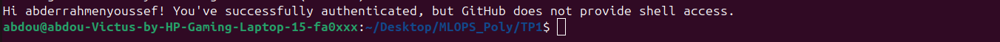

### Réponses aux questions de la partie 1

**4. Comment vérifier la configuration actuelle de Git sur votre machine, notamment le nom d'utilisateur et l'adresse e-mail ?**

```bash
git config --global --list
```

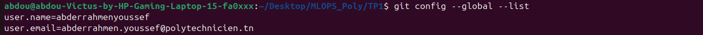

**5. Comment modifier votre adresse e-mail si vous l'avez mal configurée lors de l'installation de Git ?**

Si vous vous êtes trompé, vous pouvez corriger votre configuration avec :
```bash
git config --global user.email "nouvelle_adresse@email.com"
git config --global user.name "Nouveau Nom"
```

Cela mettra à jour la configuration globale de Git, utilisée pour tous vos dépôts.

## Partie 2 : Création d'un nouveau projet

Nous avons créé une nouvelle repository dans GitHub et l'avons clonée via son URL SSH avec :
```bash
git clone git@github.com:username/repository.git
```

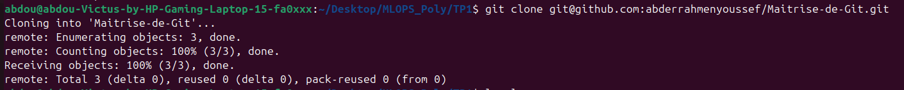

### Réponses aux questions de la partie 2

**6. Si vous avez oublié de créer un fichier README.md lors de l'initialisation du projet, comment pouvez-vous l'ajouter après coup et committer les changements ?**

Si vous avez oublié de créer un README.md lors de l'initialisation du projet, voici les étapes :
```bash
# 1. Créer le fichier README.md
echo "# Mon projet MLOPS" > README.md

# 2. Ajouter le fichier au suivi Git
git add README.md

# 3. Créer un commit avec un message clair
git commit -m "Ajout du fichier README.md"

# 4. Envoyer les changements sur le dépôt distant
git push origin main
```

**7. Comment définir un dépôt distant si vous n'en avez pas configuré un lors de la création du projet ?**

Si vous avez un dossier local contenant votre code mais aucun dépôt Git associé, voici les étapes à suivre :

```bash
# 1️⃣ Initialiser un dépôt Git local
git init

# 2️⃣ Ajouter tous les fichiers à Git
git add .

# 3️⃣ Créer un premier commit
git commit -m "Initialisation du projet local"

# 4️⃣ Ajouter le dépôt distant (par exemple sur GitHub)
git remote add origin git@github.com:votre-nom-utilisateur/fraud-detection-mlops.git

# 5️⃣ Vérifier que le dépôt distant est bien ajouté
git remote -v

# 6️⃣ Envoyer les fichiers vers le dépôt distant
git push -u origin main
```

## Partie 3 : Concepts de base de Git

Nous avons créé un fichier `eda.py` et l'avons ajouté à l'index et validé sa commit avec :
```bash
git add eda.py
git commit -m "Premier commit : ajout de eda.py"
```

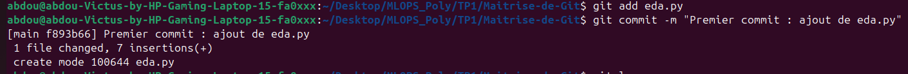

Ensuite, nous avons visualisé l'historique des commits de notre projet avec :
```bash
git log
```

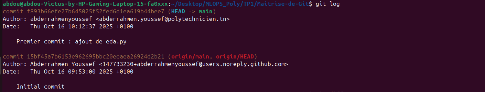

Nous avons également affiché les différences entre deux commits avec :
```bash
git diff commit_id_1 commit_id_2
```

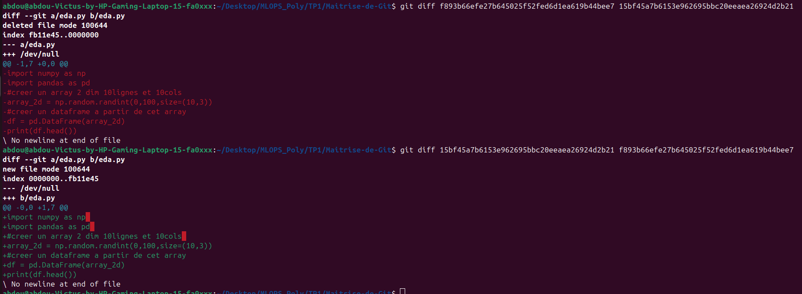

**NB :** On remarque dans cette capture que si on fait l'ID du dernier commit puis le premier, il fait le `commit_id_1` par rapport à `commit_id_2`. Même si on inverse, il est en rouge comme si on a supprimé le code, mais si on les échange, on remarque que c'est un ajout. Donc l'ordre des ID est important.

### Réponses aux questions de la partie 3

**3. Comment annuler les modifications locales d'un fichier avant de les ajouter à l'index ?**

```bash
git checkout -- nom_du_fichier
```

Exemple : j'ai ajouté ces lignes localement :
```python
print(df.info())
print(df.describe())
```

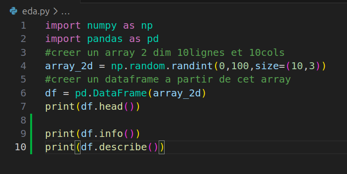

Je vais faire :
```bash
git checkout -- eda.py
```

Les modifications ont disparu :

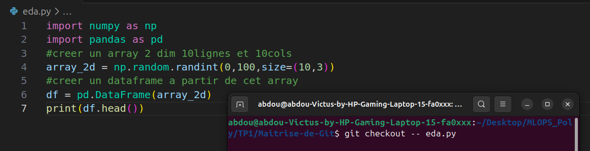

Cette commande annule toutes les modifications locales du fichier et replace le fichier dans l'état exact du dernier commit.

**4. Comment visualiser les fichiers qui sont prêts à être committés dans Git (staging) ?**

```bash
git status
```

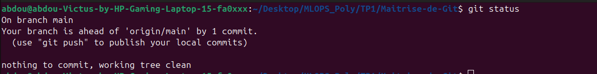

## Partie 4 : Collaborer sur Git

Nous avons créé une nouvelle branche pour travailler sur une fonctionnalité spécifique :
```bash
git branch experiment-eda  # pour créer
git checkout experiment-eda  # pour switcher
```

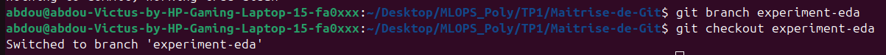

**NB :** On peut utiliser la commande `git checkout -b experiment-eda` pour faire les deux en même temps.

Ensuite, nous avons fait des modifications dans le dépôt local, ajoutées à l'index, fait un commit, puis poussé les modifications vers le dépôt distant :
```bash
git add .
git commit -m "Modification de experiment-eda"
git push origin experiment-eda
```

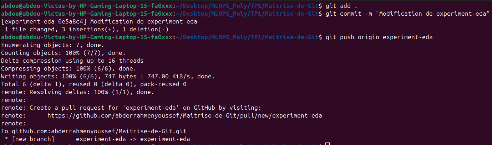

### Création d'un conflit

J'ai créé un conflit en ajoutant ceci à `eda.py` aux lignes 10 et 11 dans la branche `experiment-eda` :
```python
# afficher les statistiques descriptives du dataframe
print(df.describe())
```

Puis j'ai fait :
```bash
git commit -am "Changement dans experiment-eda"
git push origin experiment-eda
```

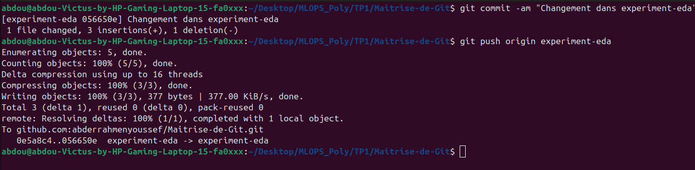

Ensuite, j'ai fait `git checkout main` pour basculer vers main et j'ai ajouté ceci aux lignes 10 et 11 :
```python
# afficher la taille du dataframe
print(df.shape)
```

Puis j'ai fait :
```bash
git commit -am "Changement dans main"
git push origin main
```

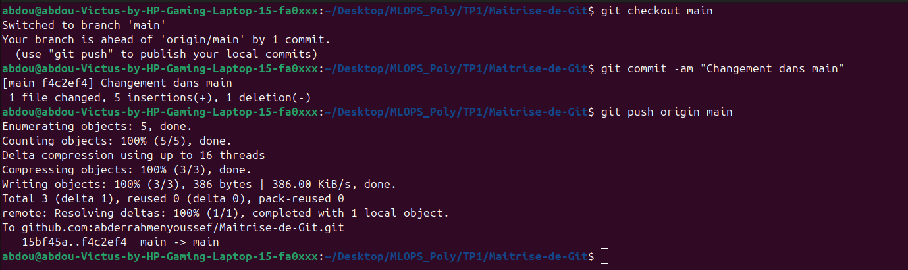

Maintenant, on essaie de faire le merge :
```bash
git merge experiment-eda
```

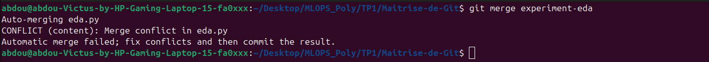

Le merge a échoué car il y a un conflit. Les mêmes lignes ont été modifiées dans les deux branches.

Pour résoudre les conflits, j'ai décalé ces deux lignes en 12 et 13 au lieu de 10 et 11, et laissé les lignes 10 et 11 vides :

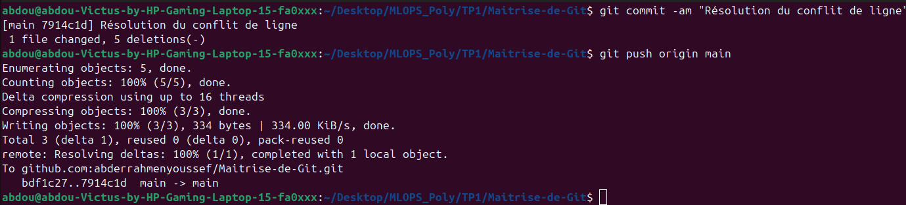

### Réponses aux questions de la partie 4

**4. Comment suivre (track) un dépôt distant et récupérer toutes les branches de ce dépôt ?**

```bash
# Récupérer toutes les branches du dépôt distant sans les fusionner
git fetch origin

# Pour afficher toutes les branches locales + distantes
git branch -a

# Pour suivre une branche distante spécifique (par exemple 'experiment-eda')
git checkout -b experiment-eda origin/experiment-eda
```

**5. Comment supprimer une branche locale après l'avoir fusionnée dans master ?**

```bash
git branch -d nom-de-la-branche
```

## Partie 5 : Rebase d'une branche sur 'main'

Nous avons suivi les étapes suivantes :

1. **Passer sur la branche main et la mettre à jour :**
```bash
git checkout main
git pull origin main
```

2. **Changer de branche pour celle à intégrer :**
```bash
git checkout experiment-eda
```

3. **Rebaser la branche experiment-eda sur main :**
```bash
git rebase main
```

4. **Résoudre les conflits :**
```bash
git add eda.py
git rebase --continue
```

5. **Retourner sur la branche main :**
```bash
git checkout main
```

6. **Fusionner sans commit supplémentaire :**
```bash
git merge experiment-eda
```

7. **Pousser les modifications sur le dépôt distant :**
```bash
git push origin main
```

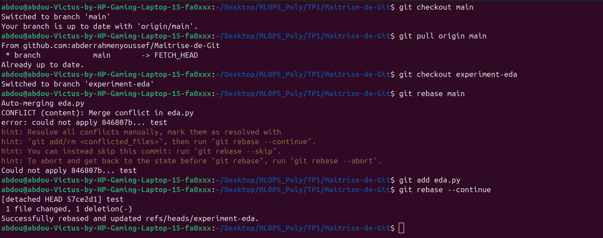

### Réponses aux questions de la partie 5

**8. Comment interrompre un rebase en cours si vous avez commis une erreur ?**

```bash
git rebase --abort
```

**9. Comment lister les commits qui vont être rebasés avant de lancer un rebase ?**

```bash
git log main..nom_de_votre_branche --oneline
```

---

*Compte rendu réalisé dans le cadre du TP1 - Maîtrise de Git*